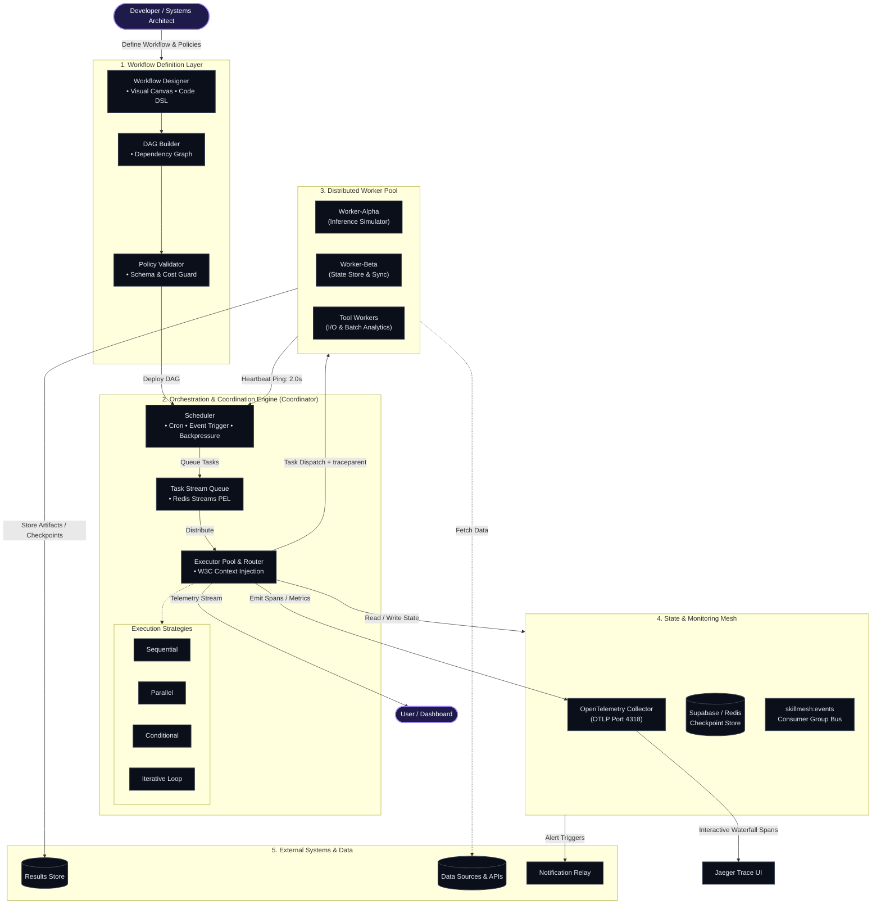

# SkillMesh

> A technical talent discovery platform and experimental distributed systems prototype for studying event-driven workflows, observability, and reliability.


---

## Overview

**SkillMesh** is a technical talent discovery platform designed to connect developers, technical professionals, and opportunities through profiles, skills, networking, and platform interactions.

The project has evolved beyond its original single-application architecture.

**SkillMesh v2** extends the platform with an experimental distributed event-driven system designed to study:

- asynchronous event processing
- distributed task coordination
- trace-context propagation
- microservice communication
- system observability
- worker health monitoring
- fault detection and recovery behavior

The v2 architecture is intended as an experimental systems prototype and research environment for evaluating how distributed application components communicate and behave under event-driven workloads.

> **Important:** SkillMesh v2 currently does not use an LLM or autonomous AI agent system. The distributed workers are system components used to simulate and study asynchronous processing and distributed coordination.

---

# Core Platform Features

SkillMesh provides a technical networking and talent discovery environment with features including:

- **Technical Profiles** — Users can create profiles showcasing their skills and technical background.
- **Skill-Based Discovery** — Designed to support talent and technical profile exploration.
- **Broadcast Signaling** — Centralized updates for hiring, opportunities, and technical activity.
- **System Insights & Analytics** — Event-oriented platform monitoring and interaction tracking.
- **Secure Handshakes** — Integrated peer-to-peer communication and collaboration mechanisms.
- **Responsive User Interface** — Interactive frontend experience designed for modern technical users.

---

# SkillMesh v2: Distributed Systems Architecture

SkillMesh v2 introduces an experimental multi-container architecture that separates asynchronous coordination and processing from the primary web application.

The architecture consists of:

- a **Coordinator service**
- an asynchronous **Redis Streams event bus**
- distributed **worker nodes**
- **OpenTelemetry trace propagation**
- worker heartbeat monitoring
- fault detection mechanisms
- distributed trace visualization through Jaeger

The system is designed to experiment with end-to-end event tracking across independently running services.

---

## System Architecture



---

# Event Flow

The experimental distributed workflow follows the general sequence below:

```text
Application Event
       │
       â–¼
Coordinator Service
       │
       │  Inject Trace Context
       â–¼
Redis Streams Event Bus
       │
       ├──────────────► Worker Alpha
       │                     │
       │                     ├── Process Event
       │                     ├── Emit Telemetry
       │                     └── Send Heartbeat
       │
       └──────────────► Worker Beta
                             │
                             ├── Process / Store State
                             ├── Emit Telemetry
                             └── Send Heartbeat

Telemetry
       │
       â–¼
OpenTelemetry
       │
       â–¼
Jaeger Trace Visualization
```

---

# Distributed Components

## Coordinator Service

The Coordinator is responsible for managing event dispatch within the experimental distributed environment.

Primary responsibilities include:

- receiving task or event requests
- generating or propagating trace context
- publishing events to Redis Streams
- coordinating worker communication
- monitoring worker health
- identifying missing heartbeats

---

## Redis Streams Event Bus

Redis Streams provides the asynchronous communication layer between distributed services.

Events are published to the stream and consumed independently by worker services.

This allows the architecture to decouple:

- event producers
- task coordination
- worker processing
- system monitoring

---

## Worker Nodes

SkillMesh v2 includes independently running worker services.

### Worker Alpha

Worker Alpha consumes events from Redis Streams and performs simulated asynchronous processing.

Its primary purpose is to provide an independent processing node for evaluating:

- event consumption
- distributed tracing
- processing flow
- worker health monitoring

### Worker Beta

Worker Beta operates as an additional distributed worker for state-oriented or secondary event processing.

The presence of multiple worker services allows the system to experiment with:

- multi-node communication
- asynchronous processing
- event routing
- distributed observability

---

# Observability

SkillMesh v2 uses **OpenTelemetry** to propagate and observe execution context across distributed services.

The architecture is designed to track event flow between:

```text
Coordinator
      ↓
Redis Streams
      ↓
Worker Nodes
```

Trace context can be propagated through asynchronous event payloads, allowing related operations to be associated across service boundaries.

This provides visibility into:

- distributed request flow
- service-to-service communication
- processing spans
- event routing behavior
- worker activity

---

## Trace Context Propagation

The system is designed around W3C-compatible trace context propagation.

The Coordinator injects trace context into event metadata before the event is published to the Redis Streams bus.

Worker services can then extract the context when processing the event.

This allows related operations to be represented as part of the same distributed trace.

Conceptually:

```text
Coordinator
    │
    │ TraceID + Context
    â–¼
Redis Event
    │
    â–¼
Worker
    │
    â–¼
Child Processing Span
```

---

# Reliability and Health Monitoring

SkillMesh v2 includes an experimental heartbeat mechanism for monitoring worker availability.

Worker services periodically emit heartbeat events to the monitoring stream.

The Coordinator monitors these signals to determine whether a worker is responsive.

The mechanism is intended to support experiments involving:

- worker availability monitoring
- missing heartbeat detection
- node failure detection
- distributed system recovery strategies

> The exact recovery and fault-handling behavior depends on the currently deployed implementation and experimental configuration.

---

# Technology Stack

## Backend and Distributed Services

- **Django** — Core web application framework
- **FastAPI** — Coordinator and distributed service APIs
- **Python** — Primary backend and systems programming language
- **Redis Streams** — Asynchronous event communication
- **OpenTelemetry** — Distributed tracing and observability
- **Jaeger** — Trace visualization
- **Docker** — Service containerization
- **Docker Compose** — Multi-container orchestration

---

## Application and Data Layer

- **Django** — Core application logic
- **Supabase** — Application data and backend services
- **Authentication Components** — User identity and access management

---

## Frontend

- **HTML**
- **CSS**
- **JavaScript**
- **Tailwind CSS**

The frontend provides the user-facing SkillMesh platform interface.

---

# Project Structure

```text
SkillMesh/
│
├── docker-compose.yml
│
├── core/
│   ├── views.py
│   ├── urls.py
│   └── ...
│
├── services/
│   │
│   ├── coordinator/
│   │   ├── main.py
│   │   ├── Dockerfile
│   │   └── requirements.txt
│   │
│   └── worker_node/
│       ├── main.py
│       ├── Dockerfile
│       └── requirements.txt
│
├── requirements.txt
├── README.md
└── ...
```

> The exact repository structure may evolve as additional services and experiments are added.

---

# Running the Distributed Environment

## Prerequisites

Before running the distributed environment, ensure that you have:

- Python
- Docker Desktop
- Docker Compose

installed and available on your system.

---

## Start the Multi-Container Cluster

From the project root:

```bash
docker compose up -d --build
```

The Docker environment is designed to launch the distributed system components, including:

- Redis
- Jaeger
- Coordinator service
- Worker nodes

---

## Check Running Containers

```bash
docker compose ps
```

---

## Stop the Environment

```bash
docker compose down
```

---

# Local Development

Clone the repository:

```bash
git clone <YOUR-REPOSITORY-URL>
cd SkillMesh
```

Create and activate a Python virtual environment:

```bash
python -m venv venv
```

Windows:

```bash
venv\Scripts\activate
```

Install project dependencies:

```bash
pip install -r requirements.txt
```

Run the application according to the configured Django project setup.

---

# Experimental Research Context

SkillMesh v2 serves as an experimental environment for studying distributed event-driven system behavior.

The research focus includes:

- asynchronous event communication
- distributed service coordination
- trace propagation across service boundaries
- observability in asynchronous systems
- worker health monitoring
- fault detection
- reliability evaluation

The platform provides a practical application environment in which distributed systems concepts can be implemented and experimentally evaluated.

---

# Version Evolution

## SkillMesh v1

The initial version focused primarily on the core SkillMesh platform and application functionality.

The system was designed as a more centralized application architecture supporting the platform's user-facing features.

---

## SkillMesh v2

SkillMesh v2 introduces an experimental distributed architecture.

Key additions include:

- multi-container services
- Coordinator-based event dispatch
- Redis Streams communication
- distributed worker nodes
- OpenTelemetry instrumentation
- trace-context propagation
- Jaeger visualization
- worker heartbeat monitoring

The purpose of v2 is not to replace the SkillMesh platform.

Instead, it extends the project into an experimental distributed systems environment.

---

# Current Scope

SkillMesh v2 currently focuses on:

- distributed systems engineering
- event-driven communication
- microservice coordination
- observability
- reliability experimentation

The current implementation **does not claim to include autonomous AI agents or LLM-based reasoning**.

Future versions may explore agent-based or AI-assisted workflows, but these are separate from the current v2 implementation.

---

# Research Direction

Future research and development may investigate:

- dynamic worker scaling
- automated fault recovery
- distributed scheduling strategies
- event replay and recovery
- advanced observability dashboards
- reliability benchmarking
- multi-agent system coordination

Any future AI-agent integration will be implemented as a separate system capability rather than being claimed as part of the current v2 architecture.

---

# Deployment

## Main Application

SkillMesh is available as a web application:

**Live Platform:** https://skillmesh.online

The production web application and the experimental distributed Docker environment should be treated as separate deployment contexts.

The distributed services are primarily intended for local experimentation, testing, and research evaluation.

---

# Documentation

Additional project documentation may include:

- architecture documentation
- deployment guides
- distributed systems operator manuals
- experimental methodology
- benchmark documentation
- research papers

---

# Author

**Nirmiti R. Tamore**

Technical Engineer | Distributed Systems | Cloud Technology | Event-Driven Architecture

---

# Research Status

SkillMesh is an actively evolving project.

The platform currently combines a functional application with experimental distributed systems research infrastructure.

The focus of ongoing development is to evaluate how event-driven architectures can improve:

- system observability
- asynchronous coordination
- reliability monitoring
- distributed workflow management

---

## License

This project is currently maintained as a personal research and development project.

License information can be added based on the intended future distribution model.
